# MobileNetV2 Knowledge Distillation- PyTorch

## Overview
Can knowledge distillation allow a lightweight MobileNetV2-based face detector to retain the performance of a larger teacher model, while reducing computational cost for application on edge devices?
<br>
| Model | Trainable Parameters | F1 | Precision | Recall | FPS (Raspberry Pi 4b) | Latency (Raspberry Pi 4b) |
| --- | --- | --- | --- | --- | --- | --- |
| Teacher | 1,990,415 | 0.6443| 0.6470 | 0.6417 | `To come...` | `To come...` |
| Student without KD | 1,338,815 | 0.5588 | 0.5636 | 0.5541 | `To come...` | `To come...` |
| Student with KD | 1,338,815 | 0.6202 | 0.6209 | 0.6194 | `To come...` | `To come...` |
> [!NOTE]
> $`F1 = \frac{2 \times precision \times recall}{precision + recall} `$
> 
<br>

<p align="center"> 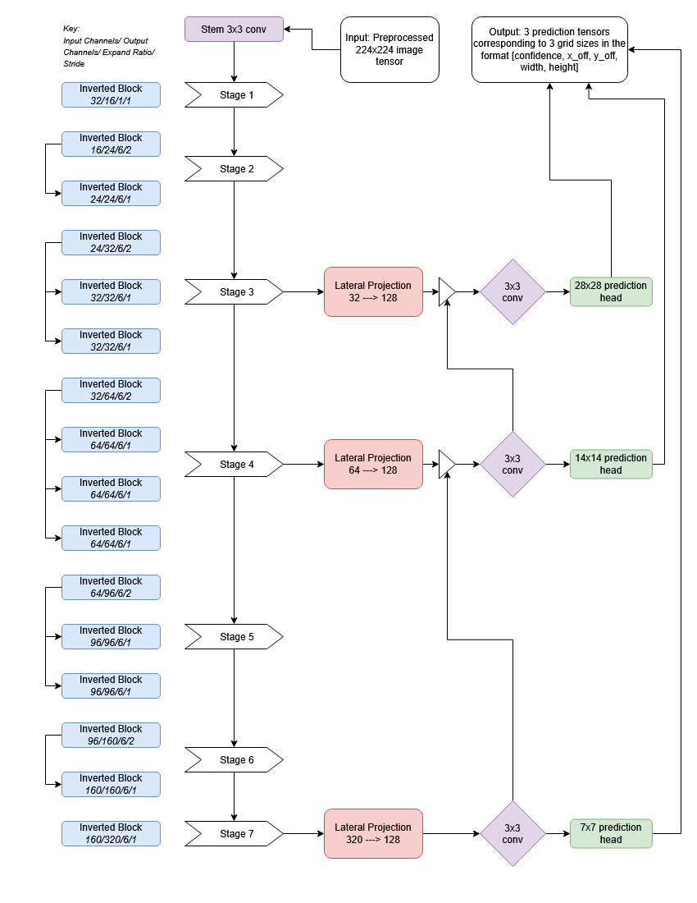 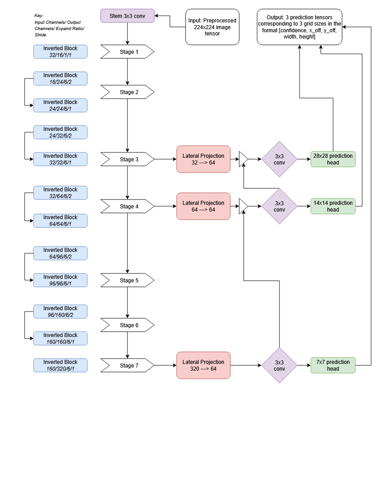 
</p> <p align="center"> <a href="#get-started">Get Started</a> • <a href="#training-results">Training Results</a> • <a href="#example-photos">Example Photos</a> • <a href="#acknowledgements">Acknowledgements</a>

## Get Started
### Requirements
For package requirements, see requirements.txt

### Download WIDER_FACE
I used a modest filtering function in my dataset script, since many faces in WIDER_FACE are simply too difficult for the YOLO-style detection head/small model and caused very poor performance. However, this is optional and adjustable. <br>
Removed 94232 / 159420 bounding boxes in training set (59%) <br>
Removed 23340 / 39708 bounding boxes in validation set (59%) <br>
These statistics are slightly misleading because faces that are filtered are usually in large crowds which can contain hundreds of boxes. <br>
[dataset script](src/Student_CNN/training/dataset.py)

Training Images:
- [Google Drive](https://drive.google.com/file/d/15hGDLhsx8bLgLcIRD5DhYt5iBxnjNF1M/view?usp=sharing)
- [Hugging Face](https://huggingface.co/datasets/wider_face/blob/main/data/WIDER_train.zip)

Validation Images:
- [Google Drive](https://drive.google.com/file/d/1HIfDbVEWKmsYKJZm4lchTBDLW5N7dY5T/view?usp=sharing)
- [Hugging Face](https://huggingface.co/datasets/wider_face/blob/main/data/WIDER_val.zip)

Annotations:
- [WIDER_FACE](http://shuoyang1213.me/WIDERFACE/support/bbx_annotation/wider_face_split.zip)

> [!IMPORTANT]
> Use annotations.py to convert csv annotations to json-style format used by the dataset code.

### Open in visual studio code
1. Download the code as a zip file.
2. Click open folder, and select the root folder to this code. 
3. Create a virtual environment, then install requirements using 
```
pip install -r requirements.txt
```
4. Finally, install the package using 
```
python -m pip install Student_CNN
```
On the debugging tab you can select which code to run.
The default options are:
- Teacher Parameters
- Student Parameters
- Train Teacher
- Analyze Camera
- Analyze Image
- Train Student

### Open in python
1. Install the package as before in the root folder.
2. Create and activate a virtual environment using
```
python3 -m venv myenv
```
followed by
```
source myenv/bin/activate
```
3. Install requirements as before.
4. To execute the package, add a `__main__.py` file and specify the package entry point.
5. Then run,
```
python -m Student_CNN
```

## Training Results
> [!NOTE]
> Graphs start from 'epoch 0' instead of 'epoch 1', which is a bug.

### Training Statistics
| | Student without KD _(epoch 17)_ | Student with KD _(epoch 17)_ |
| --- | --- | --- |
| **Training Loss** | <p align="center"> 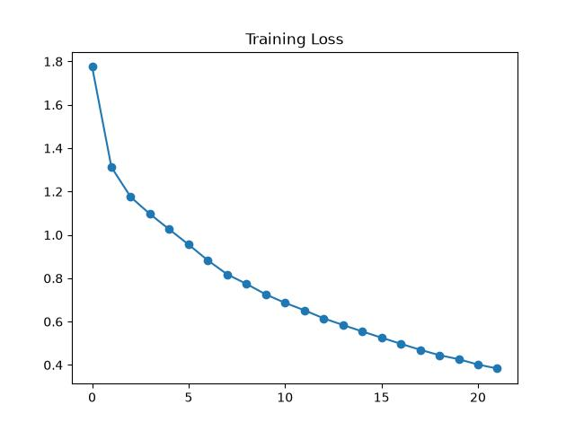 <br> Model Value = 0.4977 | <p align="center"> 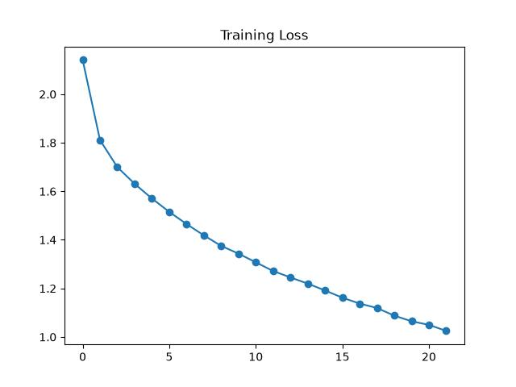 <br> Model Value = 0.4977 |
| **Distillation Loss** |<p align="center"> *No knowledge distillation used* | <p align="center"> 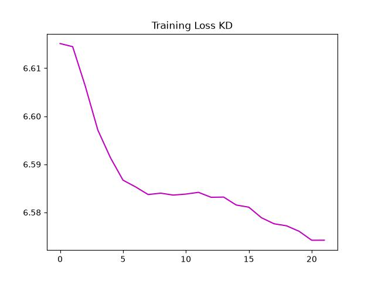 <br> Model Value = 0.4977 |
| **Validation Loss** |<p align="center"> 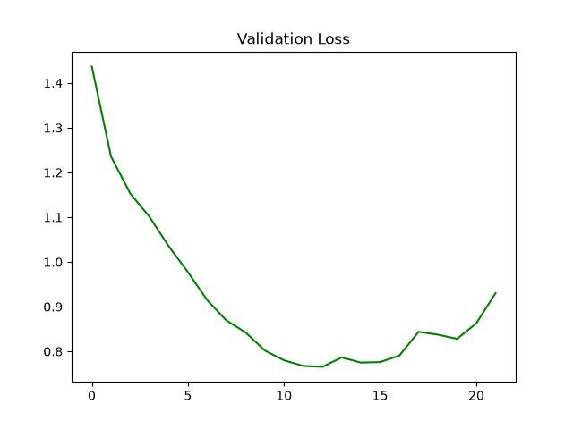 <br> Model Value = 0.7907 | <p align="center"> 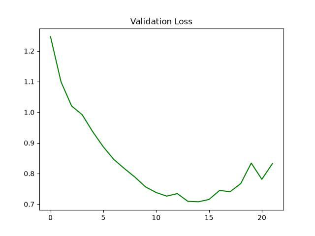 <br> Model Value = 0.7448 |
| **F1** | <p align="center"> 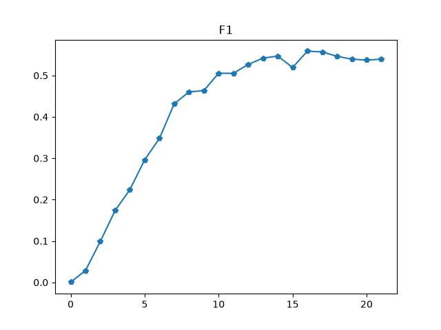 <br> Model Value = 0.5588 | <p align="center"> 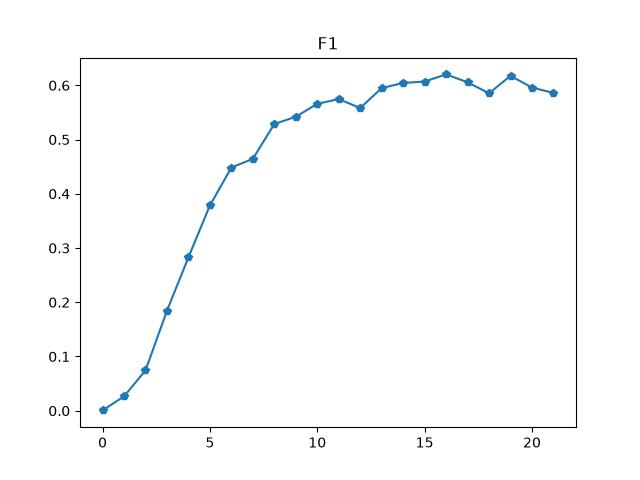 <br> Model Value = 0.6202 |
| **Precision** | <p align="center"> 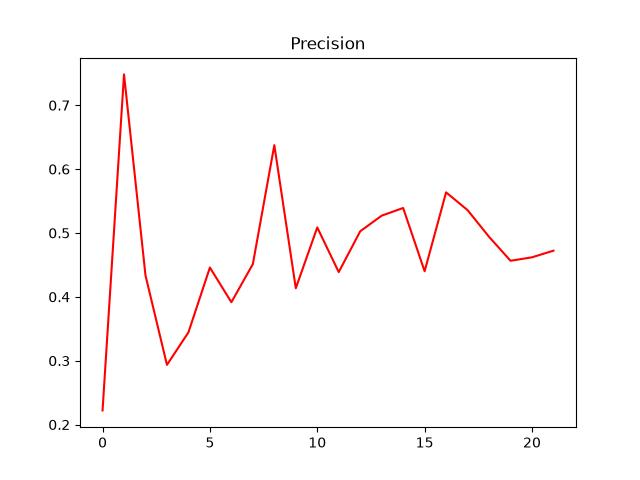 <br> Model Value = 0.5636 | <p align="center"> 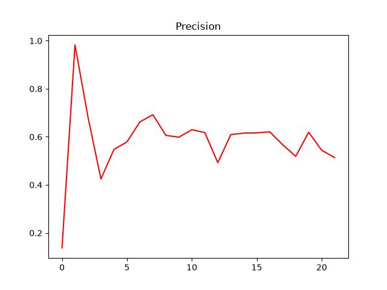 <br> Model Value = 0.6209 |
| **Recall** | <p align="center"> 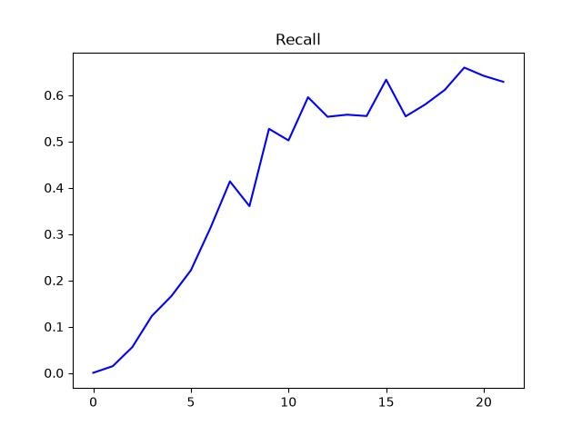 <br> Model Value = 0.5541 | <p align="center"> 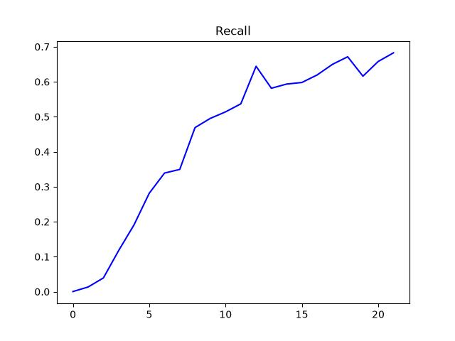 <br> Model Value = 0.6194 |
| **Comments** | Training begins to become unstable at ~ <br> epoch 17 (this is the saved model).<br> Precision oscillates as model begins <br> to make more predictions, <br> which then get more precise. | Increase of 11% in F1 as a result <br> of knowledge distillation and changing <br> confidence threshold to 0.9. Distillation <br> loss remains fairly constant (decreasing slightly) <br> and has a smoothing effect on training, <br> reducing spikes in data. |

### Current Best Hyperparameters
| | Student without KD | Student with KD |
| --- | --- | --- |
| **Loss** | `lambda_box` = 2 <br> `lambda_noobj` = 2 <br> `lambda_wh` = 1 <br> | `lambda_box` = 2 <br> `lambda_noobj` = 2 <br> `lambda_wh` = 1 <br> `lambda_kd` = 0.1 <br> `temperature` = 3 | 
| **Validation** | `confidence_threshold` = 0.8 <br> `nms_threshold` = 0.1 <br> `iou_threshold` = 0.3 | `confidence_threshold` = 0.9 <br> `nms_threshold` = 0.1 <br> `iou_threshold` = 0.3 |
| **Training**| `AdamW optimizer lr` = 1e-4 <br> `AdamW weight decay` = 1e-3 <br> `Scheduler` = CosineAnnealing (eta_min: 1e-6) | `AdamW optimizer lr` = 1e-4 <br> `AdamW weight decay` = 1e-3 <br> `Scheduler` = CosineAnnealing (eta_min: 1e-6) |
| **Comments**| High confidence threshold gave balance between precision/recall for max f1. <br> More training information in [training log](model_no_kd/log.txt). | Distillation produced large teacher loss, <br> so a low $\alpha$ (or lambda_kd in my code) produced the best results. <br> Model produced best f1 with confidence threshold = 0.9. <br> More training information in [training log kd](model_kd/student_log.txt). |

## Example Photos
### Clear Face
| Clear Face | Output without KD | Output with KD |
| --- | --- | --- |
| <p align="center"> 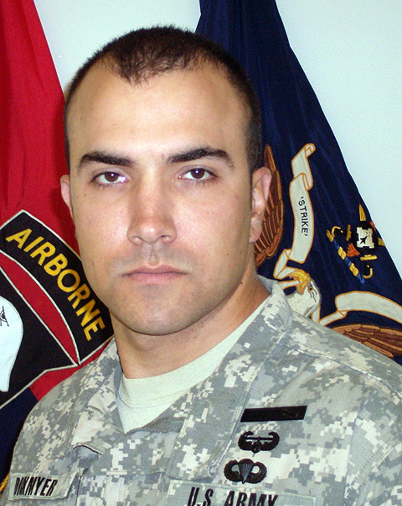 |<p align="center">  | <p align="center">  | 
| **Comments** | Model can identify clear faces with <br> a very large confidence and good localization. | Model outputs a larger bounding box <br> than the version without KD, <br> containing more of the face. |

### Obscured Face
| Obscured Face | Output without KD | Output with KD |
| --- | --- | --- |
| <p align="center"> 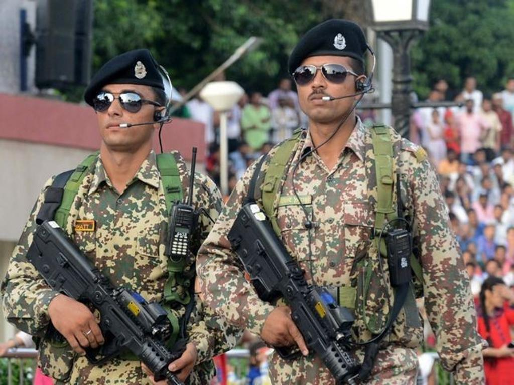 |<p align="center"> 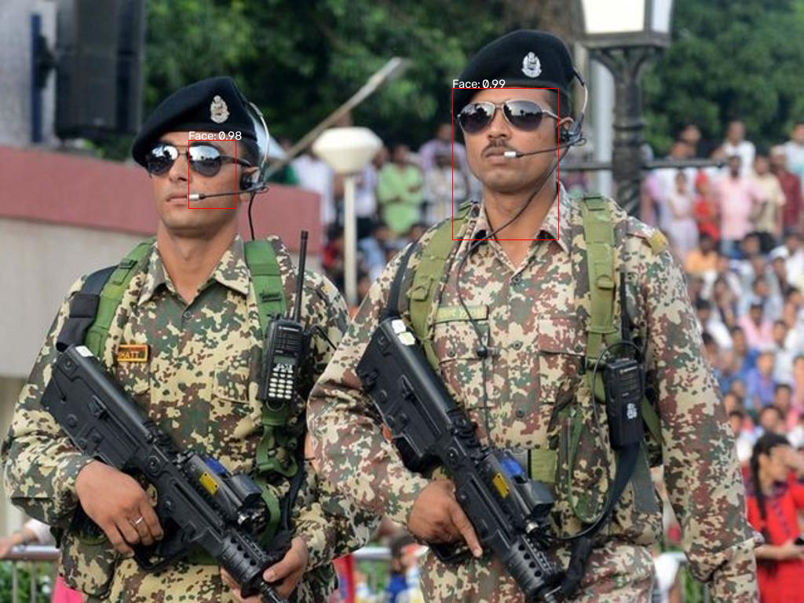 | <p align="center"> 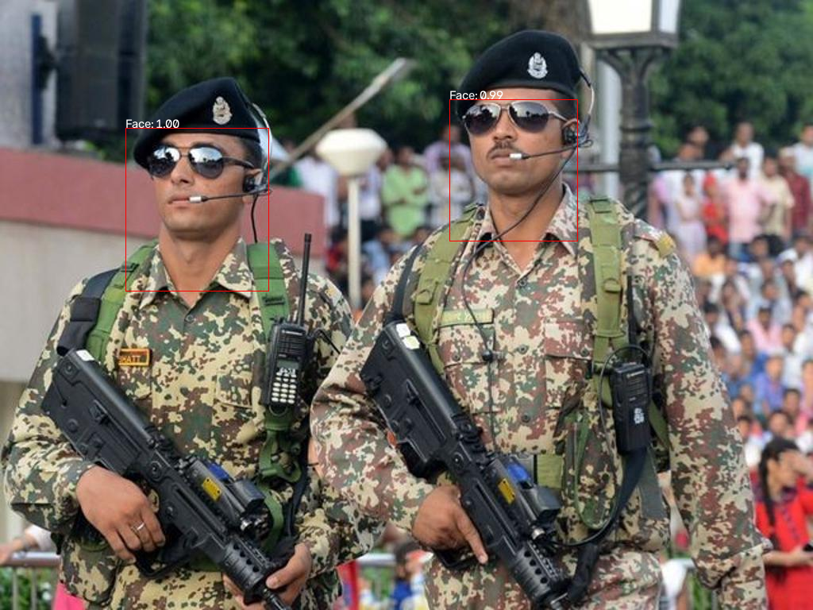 |
| **Comments** | Model can still identify faces with a ,<br> large confidence, but is less clear on <br> the location of the bounding box.| Retains accuracy on the first face, <br> however predicts a larger bounding <br> box containing more of the second face.|

### Grouped Faces
| Grouped Faces | Output without KD | Output with KD |
| --- | --- | --- |
| <p align="center"> 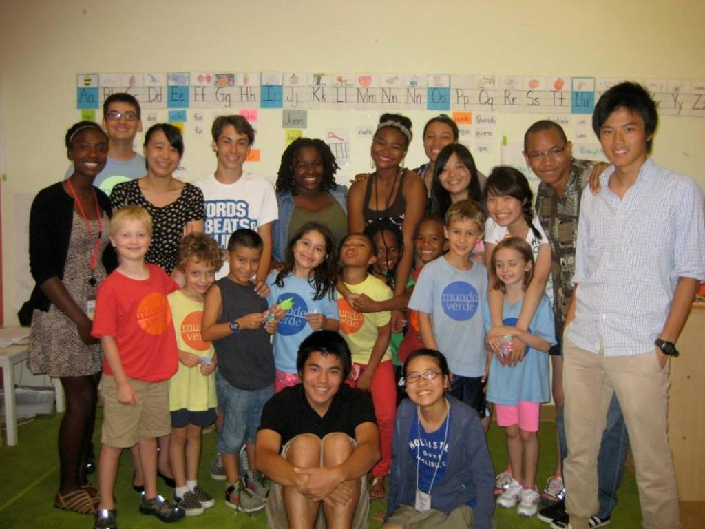 |<p align="center"> 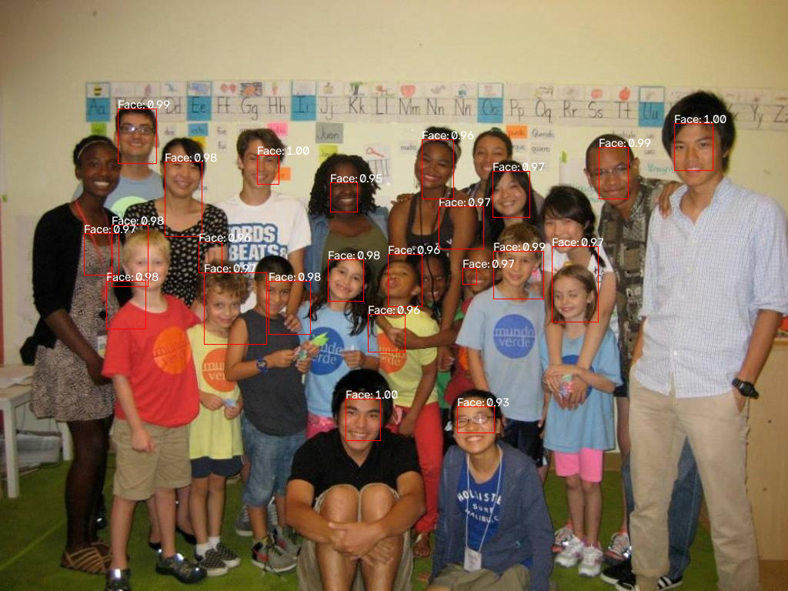 | <p align="center"> 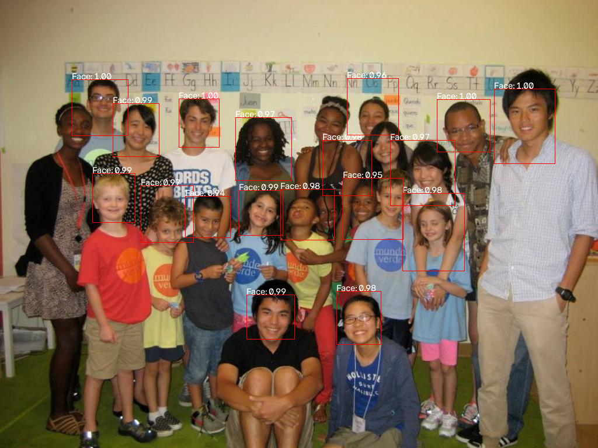 |
| **Comments** | Difficult photo, and the model successfully <br> identifies and localizes 18/22 faces.<br> There are a couple of high confidence <br> false positives close to certain faces.| The model improves significantly, <br> predicting 19/22 faces whilst outputting larger <br> and more accurate bounding boxes. |

### Animal Faces
| Grouped Faces | Output without KD | Output with KD |
| --- | --- | --- |
| <p align="center"> 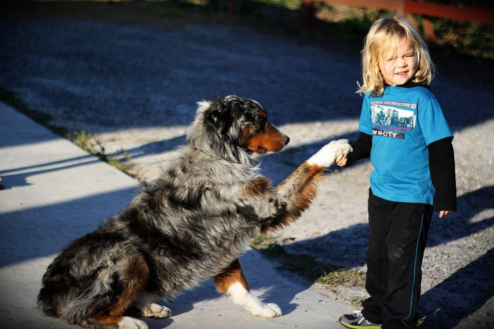 |<p align="center">  | <p align="center"> 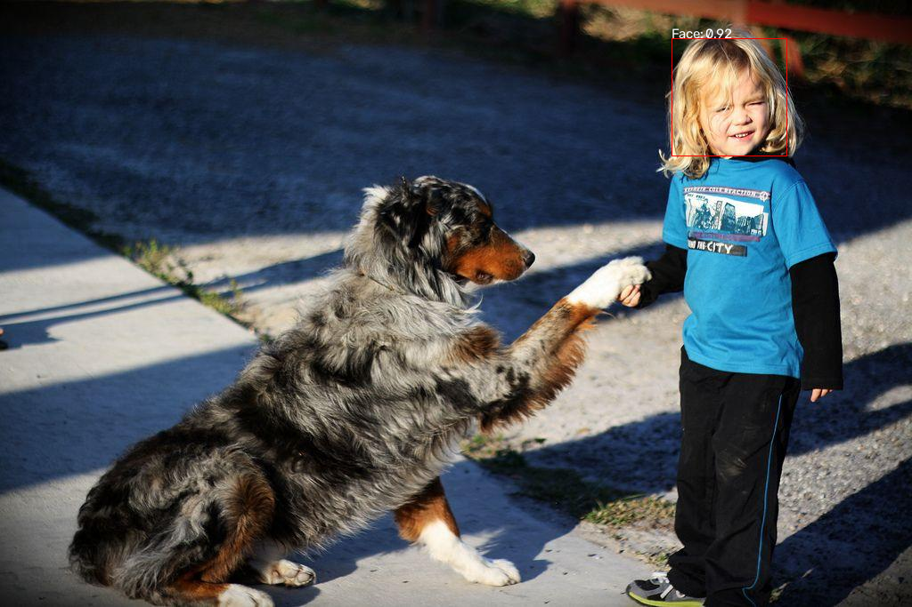 |
| **Comments** | Tested this photo as a joke, however it <br> seems the model can identify dog faces too!| Model loses its ability to predict the <br> dogs face, however it is a small <br> price to pay for the huge <br> increase in bounding box accuracy. |

## Acknowledgements
I based the model architecture of the following code: [MobileNetV2](https://github.com/jmjeon2/MobileNet-Pytorch/blob/20972586be740d5bc1e92bfb23928359be30e731/MobileNetV2.py) <br>
The feature pyramid network addition to MobileNetV2 was based of this paper: [Feature Pyramid Network](https://arxiv.org/abs/1612.03144) <br>
This lecture on knowledge distillation by Chinese University of Hong Kong was also very helpful: [Knowledge Distillation Lecture](https://www.cse.cuhk.edu.hk/~byu/CMSC5743/2024Fall/slides/Mo5-KD.pdf)
